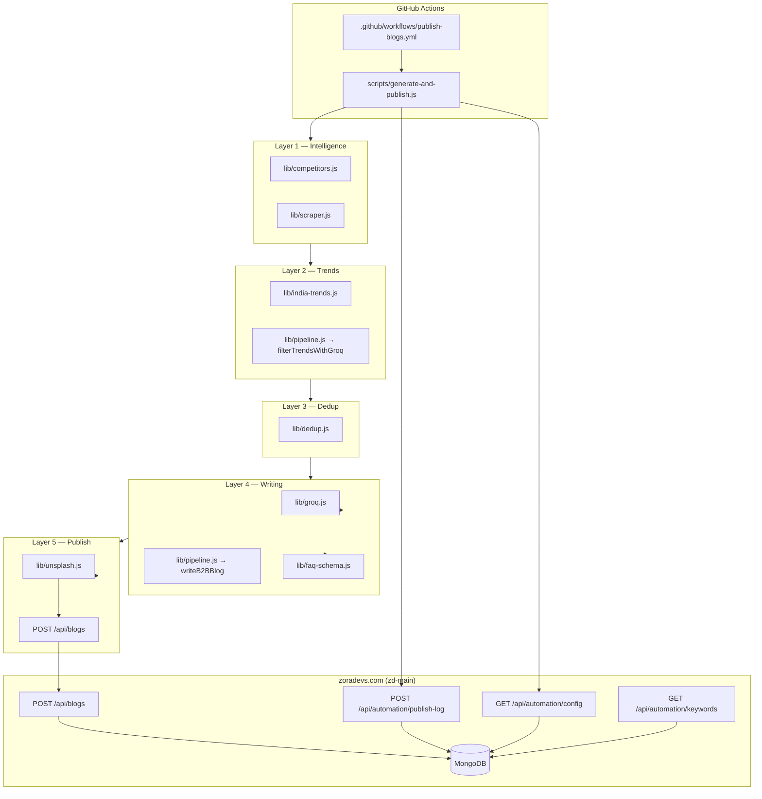

# Zoradevs Blog Automation — Complete Guide

This document explains the **entire blog automation system**: how it runs, every important file, how it connects to the Zoradevs website, and how to operate or debug it.

---

## Table of contents

1. [Overview](#overview)
2. [Architecture](#architecture)
3. [Repositories and branches](#repositories-and-branches)
4. [When it runs (GitHub Actions)](#when-it-runs-github-actions)
5. [End-to-end flow (one weekday)](#end-to-end-flow-one-weekday)
6. [Automation repo — file reference](#automation-repo--file-reference)
7. [The 5-layer pipeline](#the-5-layer-pipeline)
8. [Website repo (`zd-main`) — file reference](#website-repo-zd-main--file-reference)
9. [API contracts](#api-contracts)
10. [MongoDB collections](#mongodb-collections)
11. [Content rules](#content-rules)
12. [Secrets and environment variables](#secrets-and-environment-variables)
13. [Admin panel (human control)](#admin-panel-human-control)
14. [How blogs appear on the website](#how-blogs-appear-on-the-website)
15. [Operating modes](#operating-modes)
16. [Weekly routine](#weekly-routine)
17. [Manual run and troubleshooting](#manual-run-and-troubleshooting)
18. [Local development](#local-development)

---

## Overview

Zoradevs blog automation is a **zero-touch B2B content pipeline** that:

- Runs **Monday–Friday** (weekends skipped)
- Researches **India trends** and **competitor websites**
- Uses **Groq (Llama 3.3 70B)** to plan and write long SEO blogs
- Fetches **Unsplash** cover images from blog keywords
- Publishes to **https://zoradevs.com** via API
- Logs topics for **6-month deduplication**
- Drafts **LinkedIn posts** for manual copy-paste

The system spans **two codebases**:

| Repo | Path | Role |
|------|------|------|
| **Blog automation (bot)** | `D:\zoradevs-blog-automation` | GitHub Actions + Node.js scripts |
| **Website** | `d:\zd-main\zd-main` | Next.js site, MongoDB, admin, public blog UI |

> **Note:** There is a smaller/older copy at `d:\zd-main\zoradevs-blog-automation`. The **live** automation code is in `D:\zoradevs-blog-automation` on branch **`dev/parul`**.

---

## Architecture



---

## Repositories and branches

### Automation repo: `zoradevs-blog-automation`

| Branch | Status |
|--------|--------|
| **`dev/parul`** | **Active** — contains full pipeline, workflows, scripts |
| **`main`** | Legacy — may only contain README; **do not** run Actions on `main` without merging `dev/parul` first |

**GitHub remote:** `https://github.com/namaste-prog/zoradevs-blog-automation.git`

### Website repo: `zd-main`

Hosts the Next.js app deployed to Vercel (`zoradevs.com`), including:

- Public blog pages
- Admin CMS
- Automation APIs (`/api/automation/*`)
- Blog publish API (`POST /api/blogs`)

---

## When it runs (GitHub Actions)

**File:** `.github/workflows/publish-blogs.yml`

| Trigger | Schedule / action |
|---------|-------------------|
| **Cron** | Mon–Fri 9:00 AM IST → `30 3 * * 1-5` (UTC) |
| **Manual** | GitHub → Actions → **Publish Daily Blog** → Run workflow |

### Workflow steps

1. Checkout repo
2. `npm ci`
3. `node scripts/generate-and-publish.js` with secrets as env vars
4. Commit `published_log.json`, `linkedin_queue.txt`, `used_unsplash_ids.json` (if changed)

### Manual workflow inputs

| Input | Default | Effect |
|-------|---------|--------|
| `force_publish` | `true` | When `true`, ignores “already published today” checks and still posts |

**Always run manual workflows on branch `dev/parul`.**

---

## End-to-end flow (one weekday)

```
09:00 IST — GitHub Actions starts
    │
    ▼
Check: weekday? secrets present? already published today? (skip unless FORCE_PUBLISH)
    │
    ▼
GET /api/automation/config
    → autoTrendEnabled, recentTopics (6 mo), publishedToday, services list
    │
    ▼
┌─ Layer 1 ─────────────────────────────────────────┐
│ Discover 3 competitors (Google CSE or fallback)   │
│ Scrape zoradevs.com + competitor pages            │
└───────────────────────────────────────────────────┘
    │
    ▼
┌─ Layer 2 ─────────────────────────────────────────┐
│ Fetch Google Trends India RSS                     │
│ Groq: pick 5 candidates → rank Delhi NCR first    │
└───────────────────────────────────────────────────┘
    │
    ▼
┌─ Layer 3 ─────────────────────────────────────────┐
│ Dedup vs MongoDB + published_log.json             │
│ If overlap → uniquify topic (Delhi NCR + AI)      │
└───────────────────────────────────────────────────┘
    │
    ▼
┌─ Layer 4 ─────────────────────────────────────────┐
│ Groq metadata + FAQs                              │
│ Groq content part 1/3, 2/3, 3/3                   │
│ Expand pass if under ~2000 words                    │
└───────────────────────────────────────────────────┘
    │
    ▼
┌─ Layer 5 ─────────────────────────────────────────┐
│ Unsplash image from keywords (no repeat IDs)        │
│ Random author: Mansi | Parul | Nikhil               │
│ POST /api/blogs → live on site                      │
│ POST /api/automation/publish-log → MongoDB memory   │
│ Append linkedin_queue.txt                           │
│ Git commit logs                                     │
└───────────────────────────────────────────────────┘
```

Typical runtime: **3–8 minutes** (Groq rate-limit waits + multi-part writing).

---

## Automation repo — file reference

```
zoradevs-blog-automation/
├── .github/workflows/
│   └── publish-blogs.yml      # Cron + manual dispatch, secrets, git commit
├── scripts/
│   ├── generate-and-publish.js # MAIN ORCHESTRATOR — start here
│   └── lib/
│       ├── competitors.js      # Layer 1: find competitor domains
│       ├── scraper.js            # Layer 1: scrape page titles/H1/H2/meta
│       ├── india-trends.js       # Layer 2: Google Trends India RSS
│       ├── pipeline.js           # Layer 2+4: Groq topic filter + blog writer
│       ├── dedup.js              # Layer 3: duplicate detection + AI keywords
│       ├── groq.js               # Groq API client, retries, JSON repair
│       ├── unsplash.js           # Layer 5: keyword-based cover images
│       └── faq-schema.js         # FAQPage JSON-LD builder
├── keywords.json                 # Fallback Mon–Fri keywords (Delhi NCR + AI)
├── published_log.json            # Local publish history (backup dedup)
├── used_unsplash_ids.json        # Unsplash photo IDs already used
├── linkedin_queue.txt            # Auto-generated LinkedIn drafts
├── package.json
└── README.md
```

### `scripts/generate-and-publish.js`

**Main entry point.** Responsibilities:

| Step | What it does |
|------|----------------|
| Guards | Weekday only; requires `BLOG_API_SECRET`, `GROQ_API_KEY` |
| Config | `GET /api/automation/config` |
| Skip logic | Exits if `publishedToday` or local log has today’s success — unless `FORCE_PUBLISH=true` |
| Topic | Runs B2B pipeline or falls back to manual keywords |
| Dedup | Merges API + local recent topics; uniquifies if needed |
| Write | Calls `writeB2BBlog(brief)` |
| Image | `fetchBlogCoverImage()` from keywords |
| Author | Random: Mansi, Parul, Nikhil |
| Publish | `POST /api/blogs` |
| Log | Updates `published_log.json`, `POST /api/automation/publish-log` |
| LinkedIn | Appends formatted post to `linkedin_queue.txt` |

### `scripts/lib/competitors.js`

- Uses **Google Custom Search** (`GOOGLE_CSE_API_KEY`, `GOOGLE_CSE_CX`) with queries from website config
- Filters out zoradevs.com and clutch.co
- **Fallback** (when CSE fails): Appinventiv, ValueCoders, Radixweb

### `scripts/lib/scraper.js`

- Scrapes **Zoradevs** paths: home, all service pages, blog, about, contact
- Scrapes competitors via homepage + `sitemap.xml` (up to 12 URLs each)
- Extracts: `title`, meta description, `h1[]`, `h2[]`
- Output: `combinedText` fed to Groq for topic planning

### `scripts/lib/india-trends.js`

- Fetches: `https://trends.google.com/trending/rss?geo=IN`
- Returns trending titles + approximate traffic

### `scripts/lib/pipeline.js`

**Two major exports:**

1. **`filterTrendsWithGroq(ctx)`** — Layer 2  
   - Input: services, trends, scraped text, recent topics  
   - Output: 5 ranked candidates (Delhi NCR preferred)

2. **`writeB2BBlog(brief)`** — Layer 4  
   - Pass 1: metadata + 5 FAQs (JSON)  
   - Pass 2–4: content parts 1/3, 2/3, 3/3 (markdown)  
   - Pass 5+: expand if word count &lt; 2000  
   - Target: **2000+ words** (minimum ~1500 after expand under Groq limits)

**Prompt rules:** Delhi NCR focus, AI in every keyword set, B2B tone, Zoradevs CTAs.

### `scripts/lib/dedup.js`

| Function | Purpose |
|----------|---------|
| `slugify()` | URL-safe topic key |
| `hashKeywordCombo()` | Sorted keyword hash for dedup |
| `isDuplicate()` | Checks topic key, keyword hash, primary keyword, similar titles |
| `pickUniqueCandidate()` | First non-duplicate from Groq candidates |
| `ensureAiInKeywords()` | Injects AI into keyword list if missing |

### `scripts/lib/groq.js`

- Model: `llama-3.3-70b-versatile` (override via `GROQ_MODEL`)
- Handles **429 rate limits** with backoff
- Handles **TPM “request too large”** by reducing `max_tokens` and retrying
- `parseJson()` with `jsonrepair` fallback for malformed LLM JSON

### `scripts/lib/unsplash.js`

- Requires `UNSPLASH_ACCESS_KEY`
- Builds search queries from **blog keywords** (primary → secondary → title)
- Skips photo IDs in `used_unsplash_ids.json` + log
- Picks first **unused** relevant result (not random)
- Fallback: category default image from zoradevs.com
- Stores `image_credit` for Unsplash attribution

### `scripts/lib/faq-schema.js`

Builds Schema.org `FAQPage` JSON-LD from the `faqs` array for SEO and on-page FAQ accordion.

### Data files

| File | Auto-edited? | Purpose |
|------|--------------|---------|
| `keywords.json` | Manual | Fallback keywords Mon–Fri if admin API fails |
| `published_log.json` | Bot commits | Local backup of publish history |
| `used_unsplash_ids.json` | Bot commits | Prevents repeating Unsplash photos |
| `linkedin_queue.txt` | Bot appends | LinkedIn post drafts for you to copy |

---

## The 5-layer pipeline

### Layer 1 — Competitor discovery + website scrape

**Goal:** Give Groq real context about Zoradevs services and what competitors publish.

**Inputs:** `config.domain`, `config.competitorSearchQueries`, hardcoded Zoradevs paths.

**Output:** `scraped.combinedText` (titles, headings, meta from ~20+ pages).

---

### Layer 2 — India trends + Groq topic selection

**Goal:** Pick a fresh, relevant B2B blog angle.

**Inputs:**

- Google Trends India (10–20 items)
- Scraped website intelligence
- Zoradevs services + industry verticals (from config API)
- Recent topics (6 months)

**Groq output:** 5 candidates, each with:

```json
{
  "topic": "...",
  "service": "exact service title",
  "category": "blog category",
  "keywords": ["...", "...", "...", "...", "..."],
  "topic_key": "url-slug-dedup-key",
  "title_angle": "...",
  "india_angle": "...",
  "region_focus": "delhi-ncr | pan-india"
}
```

**Ranking:** Delhi NCR candidates sorted first.

---

### Layer 3 — Anti-duplication (6-month memory)

**Sources of “already used” data:**

1. **MongoDB** `published_topics_log` (via `/api/automation/config`)
2. **Local** `published_log.json`

**Rejected if:**

- Same `topic_key`
- Same keyword combination hash
- Same primary keyword
- Title too similar (~70% word overlap)

**On duplicate:** `uniquifyTopicEntry()` rewrites with Delhi NCR + date-stamped AI angle instead of aborting.

---

### Layer 4 — B2B content engine (Groq)

**Why multi-part writing?** Groq free/on-demand tier has ~**12,000 TPM** (tokens per minute). A single 2000-word JSON response exceeds this. The writer splits work:

| Pass | Content |
|------|---------|
| Metadata | title, slug, excerpt, meta_title, meta_description, keywords, tags, 5 FAQs |
| Part 1 | Intro, Delhi NCR context, problem, market |
| Part 2 | Solution, implementation, tech stack, Zoradevs help |
| Part 3 | ROI, mistakes, checklist, conclusion + CTA |
| Expand | Extra sections if total &lt; 2000 words |

**Retries:** Each content part retries up to 3×; attempts 2–3 use plain markdown (no JSON wrapper).

---

### Layer 5 — Image, publish, log

1. Unsplash cover from keywords
2. Random author assignment
3. `POST /api/blogs` with full payload
4. `POST /api/automation/publish-log`
5. Update local logs + LinkedIn queue
6. Git commit from Actions

---

## Website repo (`zd-main`) — file reference

```
zd-main/src/
├── app/
│   ├── api/
│   │   ├── blogs/
│   │   │   ├── route.ts              # GET list, POST create (admin + automation)
│   │   │   └── [slug]/route.ts       # GET one blog (increments views)
│   │   ├── automation/
│   │   │   ├── config/route.ts       # Bot: settings + recent topics + publishedToday
│   │   │   ├── keywords/route.ts     # Bot: day's keywords from admin DB
│   │   │   └── publish-log/route.ts  # Bot: save to published_topics_log
│   │   └── admin/
│   │       ├── blog-automation/route.ts  # Admin UI: toggle auto trend
│   │       └── blog-keywords/route.ts  # Admin UI: save weekly keywords
│   ├── blog/
│   │   ├── page.tsx                  # Blog listing (client fetch)
│   │   └── [slug]/
│   │       ├── page.tsx              # Blog post UI + author + FAQ
│   │       └── layout.tsx            # Server SEO metadata + FAQ schema
│   └── admin/
│       ├── blogs/                    # CMS blog management
│       └── blog-keywords/            # Weekly keyword editor
├── lib/
│   ├── blog-automation.ts            # Parses automation POST body → Blog model
│   ├── blog-api.ts                   # Display types, merge CMS + static blogs
│   ├── blog-keywords.ts              # Default keywords, validation
│   ├── automation-store.ts           # Mongo queries for config + dedup memory
│   ├── automation-categories.ts      # Valid blog categories list
│   ├── zoradevs-services.ts          # Service taxonomy for pipeline config
│   ├── parse-blog-markdown.ts        # Renders markdown content sections
│   └── auth.ts                       # verifyBlogApiSecret, admin auth
├── models/
│   ├── Blog.ts                       # Main blog documents
│   ├── BlogKeywords.ts               # Weekly keyword entries (Mon–Fri)
│   ├── BlogAutomationSettings.ts     # autoTrendEnabled flag
│   └── PublishedTopicsLog.ts         # 6-month automation memory
└── components/
    ├── LatestBlogs.tsx               # Home page latest 3 blogs
    ├── blogData.ts                   # Legacy static blog posts
    └── admin/BlogForm.tsx            # Manual blog editor
```

---

## API contracts

All automation endpoints require:

```http
Authorization: Bearer <BLOG_API_SECRET>
```

### `GET /api/automation/config`

**Response (key fields):**

```json
{
  "autoTrendEnabled": true,
  "dedupDays": 180,
  "domain": "https://zoradevs.com",
  "services": [ /* ZORADEVS_CORE_SERVICES */ ],
  "industryVerticals": [ "Fintech", "Healthcare", ... ],
  "competitorSearchQueries": [ "..." ],
  "recentTopics": [
    { "topicKey": "...", "title": "...", "keywords": [], "keywordHash": "..." }
  ],
  "publishedToday": null
}
```

If `publishedToday.title` is set, the bot skips (unless `FORCE_PUBLISH=true`).

---

### `GET /api/automation/keywords?day=1`

`day` = 1 (Mon) … 5 (Fri). Returns that day’s entry from admin DB or defaults.

```json
{
  "day": 1,
  "topic": "AI-powered custom software for Delhi NCR startups",
  "keywords": [ "...", "...", "...", "...", "..." ],
  "category": "Software Development",
  "weekLabel": "Week of ...",
  "updatedAt": "..."
}
```

Used when B2B pipeline fails or `autoTrendEnabled` is `false`.

---

### `POST /api/automation/publish-log`

```json
{
  "date": "2026-07-10",
  "topicKey": "ai-web-development-delhi-ncr",
  "title": "Blog title",
  "keywords": ["...", "..."],
  "category": "Web Development",
  "service": "Website Development",
  "source": "b2b-pipeline",
  "url": "https://zoradevs.com/blog/slug-here",
  "status": "success"
}
```

`source` must be one of: `b2b-pipeline`, `manual-keywords`, `fallback`.

---

### `POST /api/blogs` (automation)

Parsed by `src/lib/blog-automation.ts`. Example payload from bot:

```json
{
  "title": "...",
  "slug": "lowercase-hyphen-slug",
  "excerpt": "max 300 chars",
  "content": "## Heading\n\nMarkdown body...",
  "image": "https://images.unsplash.com/...",
  "image_credit": {
    "photographer": "Name",
    "photographerUrl": "https://unsplash.com/@...",
    "unsplashUrl": "https://unsplash.com/photos/..."
  },
  "category": "AI & Automation",
  "tags": ["tag1", "tag2"],
  "meta_title": "50-60 chars | Zoradevs",
  "meta_description": "150-160 chars",
  "keywords": ["kw1", "kw2", "kw3", "kw4", "kw5"],
  "faqs": [{ "question": "...", "answer": "..." }],
  "faqSchema": { "@context": "https://schema.org", "@type": "FAQPage", ... },
  "author": "Mansi",
  "read_time": "10 min read",
  "published": true,
  "service": "Website Development"
}
```

**Success response:**

```json
{
  "success": true,
  "blog_id": "...",
  "url": "/blog/slug-here"
}
```

---

## MongoDB collections

| Collection | Model | Purpose |
|------------|-------|---------|
| `blogs` | `Blog` | Full published blog posts |
| `published_topics_log` | `PublishedTopicsLog` | Automation dedup memory (6 months) |
| `blogkeywords` | `BlogKeywords` | Admin weekly keyword plan |
| `blogautomationsettings` | `BlogAutomationSettings` | `autoTrendEnabled` toggle |

### `Blog` document (simplified)

- `title`, `slug`, `excerpt`, `content` (markdown string)
- `image`, `imagePublicId`, `category`, `author`, `tags`
- `published`, `views`, `readTime`
- `seo.title`, `seo.description`, `seo.keywords`, `seo.faqSchema`, `seo.imageCredit`
- `createdAt`, `updatedAt`

---

## Content rules

These are enforced in Groq prompts and post-processing:

| Rule | Implementation |
|------|----------------|
| **Delhi NCR first** | Noida, Gurgaon, Delhi in topic/keywords; Pan-India as fallback |
| **AI in keywords** | `ensureAiInKeywords()` on every publish |
| **No repeat topics** | 6-month MongoDB log + local log + title similarity |
| **No repeat images** | `used_unsplash_ids.json` |
| **2000+ words** | Multi-part writer + expand passes |
| **Random author** | Mansi, Parul, or Nikhil |
| **5 FAQs** | FAQ schema for SEO + on-page accordion |
| **Unsplash attribution** | Stored in `seo.imageCredit`, shown on blog post |

### Valid blog categories

From `src/lib/automation-categories.ts`:

- Software Development
- AI & Automation
- Mobile Development
- Fintech
- Healthcare Tech
- E-Commerce
- Staff Augmentation
- Web Development
- Case Studies
- Tech Insights

---

## Secrets and environment variables

### GitHub Actions secrets (automation repo)

| Secret | Required | Purpose |
|--------|----------|---------|
| `GROQ_API_KEY` | Yes | AI writing (Groq console) |
| `BLOG_API_SECRET` | Yes | Must match Vercel — auth for all bot APIs |
| `BLOG_API_URL` | Yes | `https://zoradevs.com/api/blogs` |
| `UNSPLASH_ACCESS_KEY` | Yes | Cover images |
| `GOOGLE_CSE_API_KEY` | Optional | Better competitor discovery |
| `GOOGLE_CSE_CX` | Optional | Google Custom Search engine ID |

### Workflow env (set in YAML)

| Variable | Default | Purpose |
|----------|---------|---------|
| `GROQ_MODEL` | `llama-3.3-70b-versatile` | LLM model |
| `FORCE_PUBLISH` | `true` on manual dispatch | Skip “already published today” |

### Optional script env overrides

| Variable | Default | Purpose |
|----------|---------|---------|
| `GROQ_CALL_DELAY_SEC` | `40` | Wait before writer (rate limit) |
| `GROQ_MAX_TOKENS` | `8000` | Global max tokens cap |
| `GROQ_WRITER_MAX_TOKENS` | (deprecated) | Use `GROQ_PART_MAX_TOKENS` in pipeline |
| `GROQ_PART_MAX_TOKENS` | `4500` | Per content part |
| `GROQ_META_MAX_TOKENS` | `3500` | Metadata pass |

### Vercel env (website)

| Variable | Purpose |
|----------|---------|
| `MONGODB_URI` | Database |
| `BLOG_API_SECRET` | Automation auth (same as GitHub) |
| `BLOG_DEFAULT_IMAGE_URL` | Fallback image if Unsplash fails |

---

## Admin panel (human control)

| URL | What you do |
|-----|-------------|
| `/admin/blog-keywords` | Edit Mon–Fri keywords, categories, topics for the week |
| `/admin` (automation section) | Toggle **auto trend** on/off |
| `/admin/blogs` | View, edit, delete published blogs |
| `/admin/blogs/new` | Create manual blog |

When **auto trend is OFF**, the bot uses admin keywords (or `keywords.json` fallback) instead of the full 5-layer pipeline.

---

## How blogs appear on the website

### Listing — `/blog`

- Client component fetches `GET /api/blogs?limit=50` with `cache: no-store`
- Merges CMS blogs with static `blogData.ts` (CMS wins on slug collision)
- Category filter, load more pagination

### Post — `/blog/[slug]`

- Fetches `GET /api/blogs/[slug]`
- Falls back to static post if API misses
- Shows: category, **author**, date, read time, cover image, markdown body
- FAQ section from `seo.faqSchema`
- Unsplash credit if `seo.imageCredit` present

### Home — `LatestBlogs` component

- Fetches `GET /api/blogs?limit=10`
- Shows latest 3 posts on homepage

### SEO — `blog/[slug]/layout.tsx`

- Server-side metadata (title, description, Open Graph)
- FAQ JSON-LD injected in HTML (visible to Google without waiting for client JS)

---

## Operating modes

### Mode A — Full B2B pipeline (default)

`autoTrendEnabled: true` in admin settings.

```
Trends + scrape + Groq topic pick → write → publish
```

Best for automated, trend-aware content.

### Mode B — Manual keywords

Triggered when:

- `autoTrendEnabled: false`, or
- B2B pipeline throws (network, Groq, all duplicates)

```
GET /api/automation/keywords?day=N → write → publish
```

Best for full editorial control of weekly topics.

---

## Weekly routine

| You (~15 min/week) | Automatic |
|--------------------|-----------|
| Update keywords in admin (optional) | Mon–Fri 9 AM publish |
| Copy LinkedIn posts from `linkedin_queue.txt` | Research + writing + image |
| Re-run workflow if a day failed | Dedup + logging |
| Ensure Actions run on `dev/parul` | FAQ schema + SEO fields |

---

## Manual run and troubleshooting

### How to manually publish today

1. GitHub → **zoradevs-blog-automation** repo
2. **Actions** → **Publish Daily Blog**
3. **Run workflow**
4. Branch: **`dev/parul`**
5. `force_publish`: **`true`**
6. Run

### Common issues

| Symptom | Cause | Fix |
|---------|-------|-----|
| Workflow succeeds but no blog | `publishedToday` skip | Use `force_publish=true` |
| “Weekend — no blog scheduled” | Ran on Sat/Sun | Wait for weekday or test locally with mocked day |
| Groq TPM / request too large | `max_tokens` + prompt &gt; 12k | Already capped; ensure latest `dev/parul` |
| Blog too short / Part N failed | Groq JSON truncation | Multi-part + markdown fallback (latest code) |
| Same Unsplash image | No ID tracking | `used_unsplash_ids.json` |
| Actions can’t find script | Running on `main` | Use `dev/parul` or merge to `main` |
| 401 on API | `BLOG_API_SECRET` mismatch | Sync GitHub + Vercel secrets |
| Old blogs on website cards | Browser/API cache | Website uses `no-store`; hard refresh |

### Reading Action logs

Look for these lines:

```
Selected topic: ...
Layer 4: Writing blog with Groq ...
Part 1 word count: ...
Combined blog word count: ...
Author: Mansi
Layer 5: Publishing to https://zoradevs.com/api/blogs
Published: /blog/your-slug
```

Failure usually appears after `Groq writer failed:` or `Publish failed:`.

---

## Local development

### Prerequisites

- Node.js 20+
- Valid `GROQ_API_KEY`, `BLOG_API_SECRET`, `BLOG_API_URL`
- Optional: `UNSPLASH_ACCESS_KEY`

### Run locally

```bash
cd D:\zoradevs-blog-automation
npm install

# Windows PowerShell example
$env:GROQ_API_KEY="gsk_..."
$env:BLOG_API_SECRET="your-secret"
$env:BLOG_API_URL="https://zoradevs.com/api/blogs"
$env:UNSPLASH_ACCESS_KEY="..."
$env:FORCE_PUBLISH="true"

node scripts/generate-and-publish.js
```

Or:

```bash
npm run publish
```

> Local runs on weekends will exit immediately (`getWeekdaySlot()` returns null). Test on Mon–Fri or temporarily adjust that guard for dev only.

---

## Quick reference — who calls what

| Caller | Endpoint | When |
|--------|----------|------|
| Bot | `GET /api/automation/config` | Start of every run |
| Bot | `GET /api/automation/keywords?day=N` | Pipeline fallback |
| Bot | `POST /api/blogs` | After content + image ready |
| Bot | `POST /api/automation/publish-log` | After successful publish |
| Website | `GET /api/blogs` | Blog list, homepage |
| Website | `GET /api/blogs/[slug]` | Blog post page |
| Admin UI | `PUT /api/admin/blog-automation` | Toggle auto trend |
| Admin UI | `PUT /api/admin/blog-keywords` | Save weekly keywords |

---

## Version note

This guide reflects the **B2B 5-layer pipeline** on branch **`dev/parul`** as of July 2026, including:

- Multi-part Groq writer (2000+ words under TPM limits)
- Delhi NCR priority + AI keywords
- Unsplash keyword search + no-repeat IDs
- Random authors (Mansi, Parul, Nikhil)
- `FORCE_PUBLISH` for manual re-runs

For questions or changes, start with `scripts/generate-and-publish.js` and trace outward through the layer libraries.
